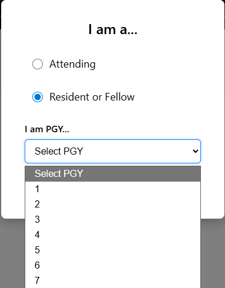
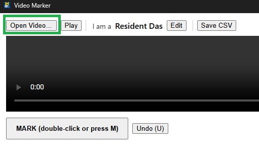

# App: vid-stamp2 

## User Guide (Resident, Attending)

### 1. Download app and run

1. Go to the Release page: https://github.com/CLocs/vid-stamp2/releases

#### Windows
2. Download the .exe file
3. Go to your downloads and double-click the .exe file. 
4. If you get a blue warning dialog, click "More info" then click "Run anyway"

#### MacOS
2. Download the .zip file
3. Go to your downloaded file and double-click it to extract it. 
4. Go inside the folder (VideoMarkerWeb_macOS) 
5. Double-click the .app file

### 2. Fill in form

1. Select if you are a Resident or Attending
2. Enter your number of post-grad years of training



### 3. Download video

1. Download the video from Google Drive: 
   - Sample video: https://drive.google.com/file/d/1D_g4jX7ErTxSYmHa39BTo5Encba5dURx/view?usp=sharing
2. Unzip the video
   - OSX: Double click the video
   - Windows: Right Click -> Extract All
3. Load video
   - click "Open Video..."
   - 
   - Select the file you downloaded above


### 4. Play and mark video

Functions
- Space toggles play/pause.
- M or Double-click the big “MARK (double-click)” button to mark an event.
- U undoes last mark.
- S saves to CSV anytime (it also auto-saves on quit).

When finished, hit "Save CSV". 

### 5. Send results

1. Find the downloaded file
   - It saves to your Downloads folder. 
   - It is named something like YYYYMMDD_HHMM_mark_[role].csv, eg, 20251217_0056_mark_attending.csv

2. Email the CSV to Colin: dascolin@gmail.com

## Developer Guide 

### Setup

First, install `uv` if you haven't already:
```shell
# On macOS/Linux
curl -LsSf https://astral.sh/uv/install.sh | sh

# On Windows (PowerShell)
powershell -c "irm https://astral.sh/uv/install.ps1 | iex"
```

Then set up the project:
```shell
# Sync dependencies (creates venv, generates lock file, and installs dependencies)
uv sync

# Activate virtual environment
# On macOS/Linux:
source .venv/bin/activate
# On Windows:
.venv\Scripts\activate
```

**Note:** `uv sync` automatically:
- Creates a virtual environment (`.venv`) if it doesn't exist
- Generates/updates `uv.lock` from `pyproject.toml`
- Installs all dependencies

If you only want to update the lock file without installing:
```shell
uv lock
```

To install dependencies after updating the lock file:
```shell
uv sync
```

**Note:** Pillow is required for macOS builds to automatically convert `.ico` icons to `.icns` format.

### Run/Debug

Activate virtual environment
- Windows
   ```powershell
   .venv\Scripts\activate
   ```
- MacOS
   ```powershell
   source .venv\Scripts\activate
   ```

Run the app
```powershell
python app.py
```

**Enable Debug Mode:**

To open the developer console for debugging, edit `app.py` and change line 147:
```python
webview.start(debug=True)  # Change from False to True
```

This will open a developer console window where you can:
- View JavaScript console logs
- Inspect the DOM
- Debug JavaScript errors
- Test the bridge API calls

**Note:** Remember to set `debug=False` before compiling for distribution.

#### macOS/Linux

```shell
# Activate virtual environment
source .venv/bin/activate

# Run the app
python app.py
```

### Compile

#### Windows --> dist\VideoMarkerWeb.exe
```shell
# Single file executable (recommended for distribution)
pyinstaller -F -w -n VideoMarkerWeb --icon assets/video_mark_icon.ico --add-data "assets;assets" app.py

# OR directory bundle (more reliable for file dialogs, recommended for testing)
pyinstaller --windowed --onedir -n VideoMarkerWeb --icon assets/video_mark_icon.ico --add-data "assets;assets" app.py
```

#### macOS --> dist/VideoMarkerWeb.app
```shell
# Directory bundle (recommended for pywebview)
# PyInstaller will auto-convert .ico to .icns if Pillow is installed
pyinstaller --windowed --onedir -n VideoMarkerWeb --icon assets/video_mark_icon.ico --add-data "assets:assets" app.py

# Alternative: If you have a .icns file, use it directly:
# pyinstaller --windowed --onedir -n VideoMarkerWeb --icon assets/video_mark_icon.icns --add-data "assets:assets" app.py

# If Gatekeeper complains during testing:
# xattr -r -d com.apple.quarantine dist/VideoMarkerWeb.app
```

**Note:** For pywebview apps, `--onedir` (directory bundle) is often more reliable than `-F` (single file) because native file dialogs and other system integrations work better. Use `-F` for Windows if you need a single executable file for distribution.

### Distribution

#### macOS
Distribute the entire `.app` bundle:
- **File to distribute:** `dist/VideoMarkerWeb.app`
- Users can double-click the `.app` file to run it
- If Gatekeeper blocks it, users can run: `xattr -r -d com.apple.quarantine VideoMarkerWeb.app`

#### Windows
**If using `-F` (single file):**
- **File to distribute:** `dist/VideoMarkerWeb.exe`
- Just the single `.exe` file

**If using `--onedir` (directory bundle):**
- **Folder to distribute:** `dist/VideoMarkerWeb/`
- Distribute the entire folder containing `VideoMarkerWeb.exe` and the `_internal/` folder
- Users run `VideoMarkerWeb.exe` from within the folder

# Analysis

## 1. Generate Transcript

Goal: generate transcript from video file. 

To be clear, we use the video file (not the audio file) to time-sync the analysis with the video. 

Currently, I use Descript to auto-generate the transcript. 
Then, I review the transcript manually to check the auto-generated text. It often gets medical jargon wrong. 

I export the transcript to SRT. 

## 2. Run analysis script

Adjust inputs 
- Path to SRT file
- (later) Path to folder of mark CSVs

Run
```shell
python analysis/parse_srt.py
```

